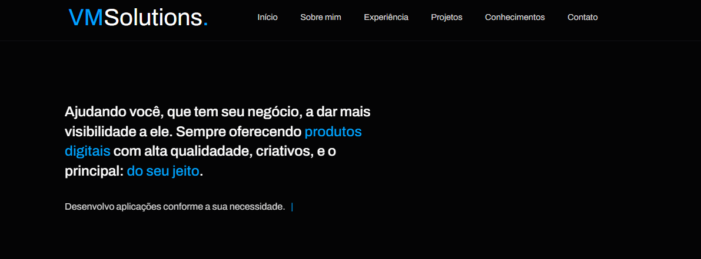

<h1 align="center">
  💻 Portfólio - Vinícius Morgan
</h1>

<h4 align="center"><a href="https://www.viniciusgmorgan.github.io/vmsolutions">Clique para visitar o projeto</a></h4>

## 📚 Seções

O site é composto por cinco seções:

- **Início:** Nele temos uma breve apresentação;
- **Sobre mim:** Nessa seção tenho uma descrição dizendo um pouco sobre quem sou;
- **Experiência:** Mostro minhas experiêcias na área de desenvolvimento;
- **Projetos:** Apresenta alguns projetos desenvolvidos e com link direto para os respectivos códigos no GitHub;
- **Conhecimentos:** Nele apresentamos meus conhecimentos em algumas linguagens e explico cada uma delas;
- **Contato:** Aqui deixo meu contato e os links para github e para baixar meu currículo

---

## 💼 Tecnologias utilizadas

Para o desenvolvimento deste site utilizei as seguintes tecnologias:

- HTML;
- Sass;
- JavaScript;
- ScrollReveal;

---

<h2>🦄 Autor</h2>

<table>
  <tr>
    <td align="center">
      <a href="https://github.com/viniciusgmorgan">
         
        
          <b>Vinícius Morgan</b>
        
      </a>
    </td>
  </tr>
</table>
